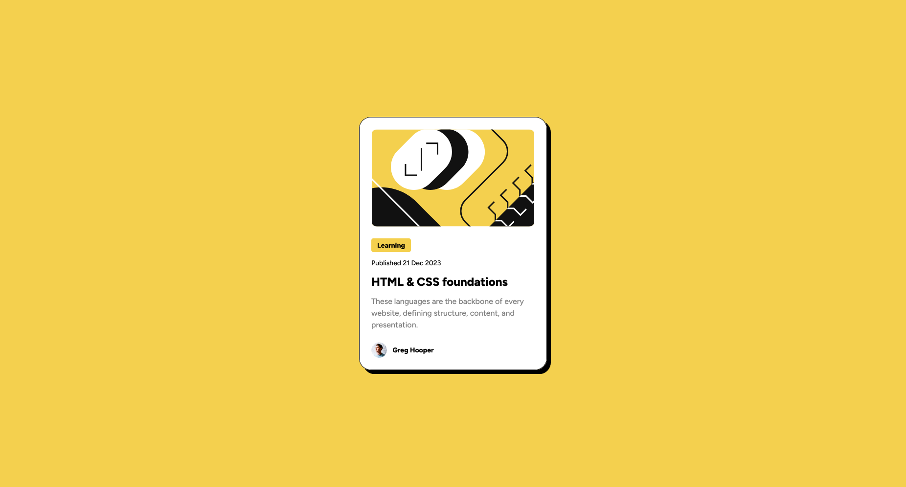

# Frontend Mentor - Blog preview card solution

This is a solution to the [Blog preview card challenge on Frontend Mentor](https://www.frontendmentor.io/challenges/blog-preview-card-ckPaj01IcS).

## Table of contents

- [Overview](#overview)
  - [The challenge](#the-challenge)
  - [Screenshot](#screenshot)
  - [Links](#links)
- [My process](#my-process)
  - [Built with](#built-with)
  - [What I learned](#what-i-learned)
- [Author](#author)

## Overview

### The challenge

Create a blog preview card.

Users should be able to:

- See hover and focus states for all interactive elements on the page

### Screenshot

### Links

- Solution URL: [Add solution URL here](https://your-solution-url.com)
- Live Site URL: [Add live site URL here](https://your-live-site-url.com)

## My process

### Built with

- [Tailwind](https://tailwindcss.com/) - CSS framework
- [React](https://reactjs.org/) - JS library
- [Vite](https://vitejs.dev/) - Module bundler

### What I learned

Before that, I tried Tailwind and React separately, but for this project I decided to use both of them.

## Author

- Frontend Mentor - [@RomanPreslitsky](https://www.frontendmentor.io/profile/RomanPreslitsky)
